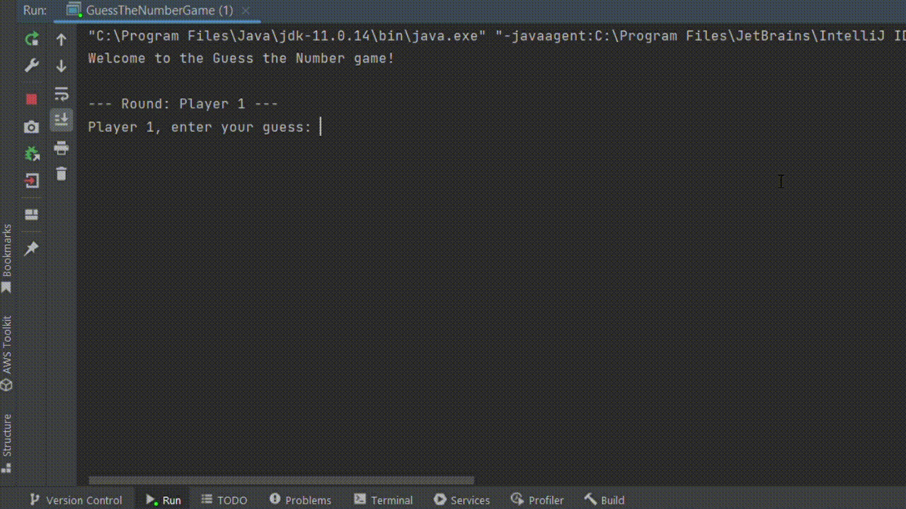

# Adivinhe o Número - Guess the Number

## Índice

* [1. Considerações Gerais](#1-considerações-gerais)
* [2. Prefácio](#2-prefácio)
* [3. Resumo do Projeto](#3-resumo-do-projeto)
* [4. Objetivos de Aprendizagem](#4-objetivos-de-aprendizado)
* [5. Considerações Gerais](#5-considerações-gerais)
* [6. Marcos do Projeto](#6-marcos-do-projeto)
* [7. Desevolvedora](#7-desenvolvedora)

---

## 1. Considerações Gerais

* Este projeto foi desenvolvido individualmente e foi realizado em 3 sprints.

## 2. Prefácio

Atualmente, Java é uma das linguagens de programação mais utilizadas no mundo.
Apesar da diversidade de plataformas e ferramentas disponíveis, é fundamental
ter uma base sólida nos conceitos fundamentais de Java e na programação
orientada a objetos (OOP). O objetivo deste projeto é te introduzir ao mundo do
Java por meio de um jogo simples e divertido.

## 3. Resumo do Projeto

Trata-se de um jogo interativo que ocorre no terminal utilizando Java. Nele, a jogadora e o computador se revezam para tentar adivinhar um número aleatório entre 1 e 100. Ambos alternarão suas suposições, levando em conta a tentativa anterior. Após cada palpite, são exibidos o nome do jogador, a suposição feita e uma mensagem indicando se a suposição foi "muito alta", "muito baixa" ou "correta". O jogo tem um limite de 5 tentativas por rodada e termina assim que o número é adivinhado. Após o término, uma mensagem de fim de jogo é exibida juntamente com a lista de todas as tentativas feitas pela jogadora vencedora e a lista completa de todas as tentativas. A lógica do jogo se baseia em estruturas de controle, como loops, condicionais e coleções.

## 4. Objetivos de Aprendizado

### Java & OOP

* [X] **Tipos de dados: primitivos vs não primitivos**
  são informações que não são representadas como um Objeto e, consequentemente, não possuem funcionalidades adicionais.
byte:
short: Descreve números inteiros de 16 bits. Seu intervalo é superior ao do tipo byte.
int: Indica números inteiros de 32 bits.
long: Indica números extensos de inteiros.
float: Descreve números de ponto flutuante com 32 bits. Utilizado para representar números reais.
double: Refere-se a números de ponto flutuante com 64 bits, empregado para números reais com elevada precisão.
char: Representa um único caractere Unicode. Por exemplo: 'A', '1'.
boolean: Indica valores verdadeiros ou falsos.

      Tipos de dados de referência:

String: Uma sequência composta por caracteres.
Arrays: Agrupamentos de elementos do mesmo tipo, como int[], String[], etc.
Classes Personalizadas: Dados modelados pelo programador, como classes definidas.
Interfaces: Especificações de métodos que uma entidade deve implementar.
Enumerações (Enum): Tipos particulares usados para representar um conjunto definido de valores.

* [X] **Strings (cadeias de caracteres)**
* [X] **Arrays (matrizes)**
* [X] **_Access Modifiers_: `private`**
* [X] **_Access Modifiers_: `protected`**
* [X] **_Access Modifiers_: `public`**

* #### Programação Orientada a Objetos (OOP)

  - [X] **Classes**
  - [X] **Objetos**
  - [X] **Métodos**
  - [X] **Atributos**
  - [X] **Construtores**
  - [X] **Encapsulamento**
  - [X] **Abstração**
  - [X] **Composição**
  - [X] **Interfaces**
  - [X] **Herança: `super`**
  - [X] **Herança: `extends`**
  - [X] **Herança: `override`**
  - [X] **Linguagem Unificada de Modelagem (UML): Diagramas de classes**

* [X] **Variáveis**
* [X] **Condicionais**
* [X] **Uso de loops/ciclos (loops)**

* #### Coleções

  - [X] **Listas: ArrayList**

* #### Testes

  - [X] **JUnit**
  - [X] **Mockito**

## 5. Considerações Gerais

* Deve ser implementado em Java. As únicas dependências externas que podem ser
  usadas são JUnit e Mockito para testes unitários.
* O jogo será realizado no terminal. Os testes podem ser executados no
  terminal ou em seu IDE (recomendamos usar
  [IntelliJ Community Edition](https://www.jetbrains.com/idea/download/))

### Diagrama de Classes

![Diagrama de Classes](https://camo.githubusercontent.com/c18b541fa2d8452bfff226b4825dc0b08a34903a7ad212685052f3bd6e4d9049/68747470733a2f2f6d65726d6169642e696e6b2f696d672f70616b6f3a654e7039556b3150777a414d5f5374573247486431772d6f706b6b4970484a436948476a484c7a57744b564e4f6a6b4a306a5332333037537246736e4453354e3432635f2d7a316e4c3749324a78474c724547744879737347475771414c6f374a4a61306669767032636f4e63594b53594f395267446c3834546375724b6d6178537571764a58413354487138556f5a4d4d67466d56423942724b537372706a4872383075434f47625864454939693062554f6f517559554a465a7176445a6371654c39417879586a68794c52775f2d63324f367958774f6764516e6e4f6958507937365a435771323942444b37665745465f5135524933326a426d5a725561384156547772333349597748796e55506b6274375a7477646e66776a46483543306863394e51586830635437303865395236352d4845466747385354774f4367432d335a6744445051466d5f6e656d675539396f554845742d4c7a53507a62364436575943556e73317053374a395452704d4b55354b77517366764e6b657455704d726e6f54587465716379455275324e424e326d364f6830347354385363326d67365f33536a626f773f747970653d706e67)

#### `GuessTheNumberGame`

**Propósito:**
Lida com a lógica principal, decide qual jogador assume o próximo turno.

**Atributos estáticos (`static`):**

* `random`: Gerador de números aleatórios.
* `targetNumber`: Número aleatório entre 1 e 100 a ser adivinhado na partida
  atual.

**Métodos estáticos (`static`):**

* `main(String[] args)`: Inicia o jogo e gera o número aleatório.
* `checkGuess(Player player)`: Executa um turno, obtém a suposição e avalia
  o novo estado da partida.

#### `Player`

**Propósito:**
Representa uma jogadora genérica. É uma classe abstrata. Define os
atributos e métodos que todas as _classes_ de jogadoras devem compartilhar:

**Atributos:**

* `name`: O nome da jogadora.
* `guesses`: O histórico de suposições da jogadora.

**Métodos:**

* `makeGuess()`: Retorna a suposição da jogadora. É um método abstrato.
* `getName()`: Retorna o nome da jogadora.
* `getGuesses()`: Retorna o histórico de suposições da jogadora.

#### `HumanPlayer` e `ComputerPlayer` (herdam de `Player`)

**Propósito:**
Representa as jogadoras _Humana_ e _Computadora_, respectivamente.

**Métodos:**

* `makeGuess()`: Método que cada classe que herda de `Player` deve implementar.

**Relações:**

* A classe `GuessTheNumberGame` interage com as classes `HumanPlayer` e
  `ComputerPlayer` para gerenciar o jogo.
* Tanto a classe `HumanPlayer` quanto `Computer Player` são subclasses de
  `Player`, o que implica que herdam todas as suas propriedades e métodos, mas
  também têm algumas características adicionais próprias.

Este design de classes permite separar as responsabilidades, facilitando
a manutenção e possíveis extensões do jogo no futuro.

Por exemplo, poderíamos adicionar diferentes jogadoras "máquina" com diferentes
estratégias para a suposição automática, um novo tipo de jogadora "remota" ou
até mesmo diferentes níveis de dificuldade.

## 6. Marcos do projeto 

**Configurações do ambiente de trabalho**

É necessário preparar o ambiente de trabalho seguindo estas etapas:

* Fazer o download da versão selecionada do Java e proceder com a instalação no seu dispositivo. Recomendamos, atualmente (outubro e novembro de 2023), a versão 17, pois está mais alinhada com a IDE IntelliJ.
* Configurar a sua IDE (sugerimos utilizar a IntelliJ Community Edition). Em situações excepcionais, por limitações de recursos computacionais, o VSCode pode ser considerado como alternativa.

#### Conteúdos que podem te apoiar na configuração do ambiente
 * [Tutoriais para preparação de ambiente Java](https://narasakamoto.github.io/prep-ambiente-java/)
 * [Como eu instalo o Java?](https://www.java.com/pt-BR/download/help/download_options_pt-br.html)
 * [Install IntelliJ IDEA](https://www.jetbrains.com/help/idea/installation-guide.html)
 * [Step by Step guide to install Intellij Idea
on Mac](https://www.geeksforgeeks.org/step-by-step-guide-to-install-intellij-idea)

**Primeiros passos com a linguagem**

Classe Inicial do Projeto com Método Main:
Inicie a construção da primeira classe do seu projeto, incluindo o método main. Experimente inserir um comando para exibir "Olá mundo!" no console, permitindo assim a verificação das configurações realizadas. Além disso, é uma boa oportunidade para explorar conceitos fundamentais da linguagem.

Classes e Construção de Objetos:
Na programação orientada a objetos, uma classe é um modelo que define as características de um objeto. Ela representa um plano para criar instâncias específicas. Em resumo, uma classe é composta por atributos (dados) e métodos (ações) que descrevem o comportamento de um objeto.

Atributos e Métodos:
Os atributos armazenam os dados de um objeto, enquanto os métodos representam os comportamentos associados à classe. Por exemplo, uma classe Carro pode conter métodos como ligar, desligar e acelerar.

Construtor e Método Principal:
O método construtor, como o GuessTheNumberGame(Random random), é responsável por inicializar objetos quando são criados. Já o método principal (main) cria uma instância do jogo, exibe uma mensagem de boas-vindas e instruções, além de imprimir o número alvo no console (normalmente não realizado em um jogo real, utilizado apenas para depuração).

Loop do Jogo e Verificação de Suposições:
O loop do jogo interage com os jogadores (humano e computador), permitindo a realização de suposições e verificando se são muito altas, muito baixas ou corretas. O jogo continua até o jogador acertar ou alcançar o limite de tentativas.

Modificadores de Acesso e Encapsulamento:
Os modificadores de acesso, como public, private e protected, regulam a visibilidade dos membros de uma classe. O encapsulamento, por sua vez, protege os dados da classe, permitindo acesso controlado por meio de métodos.

Herança e Polimorfismo:
A herança é um conceito que permite que uma classe herde características de outra. Por exemplo, a classe Player pode ser estendida por PlayerHuman e ComputerPlayer, permitindo a reutilização de código e a utilização de objetos de subclasse como objetos de superclasse (polimorfismo).

Tipos de Dados em Java:
Java possui tipos primitivos, como int, double, char, boolean, e tipos de referência, como String e Arrays. Eles têm semelhanças com tipos de dados em JavaScript, por exemplo, int (números inteiros) e String (sequências de caracteres).

Espero que estas informações proporcionem uma compreensão mais clara dos conceitos abordados.

#### Conteúdos que podem te apoiar na configuração do ambiente
 * [Learn the Basics of Java Programming](https://www.freecodecamp.org/news/learn-the-basics-of-java-programming/)
 * [Programação Orientada a Objetos com Java - Kamila Code](https://www.youtube.com/watch?v=zHPx0vyFMOI&list=PL_pqVN-1MnwNhaNktj8ukfX9yfjWFf7S-)
 * [Java Basic Syntax](https://www.geeksforgeeks.org/java-basic-syntax/)
 * [Java Data Types And Variables – Explained for Beginners](https://www.freecodecamp.org/news/java-data-types-and-variables/)
 * [Learn Java](https://my-learning.w3schools.com/tutorial/java)
 * [Java Classes and Objects](https://www.w3schools.com/java/java_classes.asp)
 * [Java Methods](https://www.w3schools.com/java/java_methods.asp)

**Compreendendo o Diagrama de Classes**

Deixamos um [Diagrama de Classes](#diagrama-de-classes) para que você possa se basear para construir o seu projeto. Mas é preciso compreender o que ele significa antes mesmo de começar a desenvolver o que será o seu projeto. Neste marco você pode compreender o que esse diagrama está representando. 

#### Conteúdos que podem te apoiar na compreensão do Diagrama de Classes
* [O que é um diagrama de classe UML?](https://www.lucidchart.com/pages/pt/o-que-e-diagrama-de-classe-uml)
* [O que são os Diagramas de Classe](https://www.devmedia.com.br/orientacoes-basicas-na-elaboracao-de-um-diagrama-de-classes/37224)
 

#### Conteúdos que podem te apoiar para iniciar o jogo
* [Java: Como ler e apresentar dados com os comandos de entrada e saída](https://www.devmedia.com.br/java-como-ler-e-apresentar-dados-com-os-comandos-de-entrada-e-saida/22266)
* [Java Scanner](https://www.baeldung.com/java-scanner)
* [Scanner class in Java](https://www.geeksforgeeks.org/scanner-class-in-java/)
* [Java User Input](https://www.w3schools.com/java/java_user_input.asp)
* [Random Number](https://www.baeldung.com/java-17-random-number-generators)

**Configurações para construção dos testes unitários para criação dos testes unitários**

Configure as bibliotecas JUnit5 e Mockito na sua IDE, para a criação dos testes unitários.

#### Conteúdos que podem te apoiar para adicionar dependências de testes
* [Adicionar JUnit5 no IntelliJ](https://www.jetbrains.com/help/idea/junit.html#intellij)
* [Testing Java with VSCode](https://code.visualstudio.com/docs/java/java-testing)

Estrutura dos testes unitários: cobrir com testes a lógica do jogo baseando-se em comportamentos. 
* Simula que o palpite da jogadora é maior que o número alvo.
* Simula que o palpite da jogadora é menor que o número alvo.
* Simula que o palpite é o próprio número alvo. 

#### Conteúdos de apoio na criação dos testes unitários
* [Qualidade e JUnit: introduzindo automatização de testes unitários do seu software Java no dia-a-dia](https://mari-azevedo.medium.com/qualidade-e-junit-introduzindo-automatiza%C3%A7%C3%A3o-de-testes-unit%C3%A1rios-do-seu-software-java-no-dia-a-dia-849611de5574)
* [Mockito Tutorial](https://www.digitalocean.com/community/tutorials/mockito-tutorial)

**Aprimoramento da Jogabilidade Contra o Computador (Edição Hacker)**

Nesta etapa, identificada como a Edição Hacker, você terá a oportunidade de implementar uma estratégia para aprimorar a tomada de decisão da segunda participante durante o jogo contra o computador. Estas decisões podem ser mais perspicazes ao considerar se o palpite é superior ou inferior ao número alvo, resultando em uma experiência de jogo mais desafiadora e emocionante.

## 7. Desenvolvedora

 <a href="https://github.com/Keilaoliveira0112">Keila Costa</a>

**_Divirta-se construindo seu jogo de adivinhação de números! 🎲🎮_**
